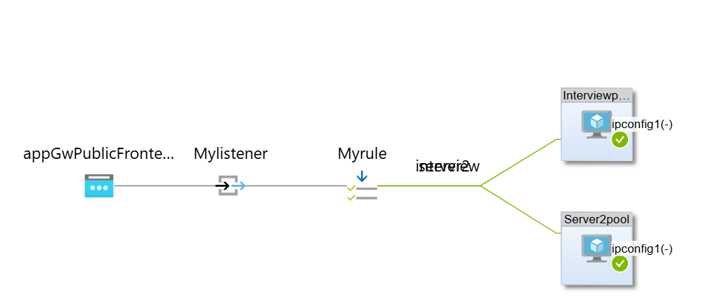

# Internship Assignment
## overview
     This project includes the deployment of an azure-based web application infrastructure. The setup includes:
     - **Three Virtual Machines (VMs)** running Apache to serve different responses naming as Server1,Server2,Interview
     - **Azure Application Gateway** for load balancing.
     - **Path-based routing** to direct requests to  /server2, and /interview.
     - **Azure Private DNS** (`dvstech.com`) for name resolution of the servers.

## Architecture
The following diagram illustrates the infrastructure:

     

## Create Virtual Network (VNet) and Subnets
   * Sign in to the Azure portal
   * Navigate to "Virtual Networks"
   * Click "Create"
   * Configure:
     - Name: Server1-vnet
     - Address space: 10.0.0.0/16
     - Subscription and Resource Group: Free trail & chenna
     - Location: Choose a region with 3 availability zones
* Create 3 private subnets across 3 availability zones
     

## Create Virtual Machines
   * Go to "Virtual Machines" in Azure portal
   * Click "Create" and select "Azure virtual machine"
   * Create 3 VMs (server1, server2, interview):
     - Image: Choose an appropriate Linux image
     - Size: Select as per requirements (e.g., Standard_B1s)
     - Authentication: Use password based authentication
     - Networking: Place each VM in a different private subnet
* Add custom data while creating VM
    *  - #!/bin/bash
    * - yum install httpd -y
    * - systemctl enable httpd
    * - mkdir /var/www/html/Interview
    * - echo "Hi Team I am  interview server" > /var/www/html/Interview/index.html
    * - systemctl restart httpd
* Need to ensure that adding of port 80:
  

        

##  Create Application Gateway
* In Azure portal, go to "Application Gateways"
* Click "Create"
* Basic settings:
    - Name: AGW
    - Tier: Standard v2
* Network settings:
    - VNet: Server1-vnet
    - Subnet: Create a dedicated subnet for the Application Gateway
* Configure frontend IP, backend pools, and routing rules
*  Review and create

  

##  Set Up Azure Private DNS Zone
-   Go to "Private DNS zones" in Azure portal
-   Create a new zone: dvstech.com
-  Link to Server1-vnet
-  Need enable auto registration

  
  

  

  
  
  
  
 
##  Verify and Test

1. Access the Application Gateway's public IP or DNS name
2. Test paths: http://4.254.42.251, /Server2, /Interview
3. From a VM within the VNet, test DNS resolution for the server

